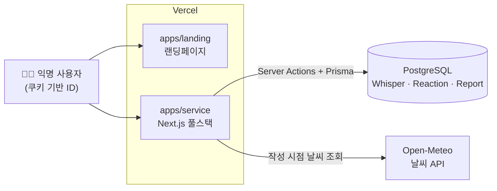
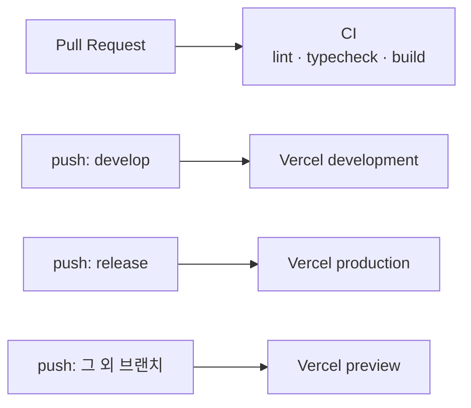

<p align="middle">
  
</p>
<h1 align="middle">날씨의 속삭임 🌤️</h1>
<p align="middle">날씨 변화에 따른 감정과 상황을, 익명으로 나누는 커뮤니티</p>

<div align="center">


</div>

## 💬 서비스 소개

`날씨의 속삭임`은 **날씨 변화에 따른 다양한 감정과 상황을 익명으로 소통하며 공감대를 형성하는 커뮤니티**입니다.

날씨라는 보편적이면서도 매일 변하는 주제를 통해 지속적인 컨텐츠 업데이트와 참여를 유도합니다. ☀️

익명성을 기반으로 하여, 실제 날씨에 대한 솔직한 느낌이나 생각을 공유함으로써 사용자 간의 심리적 안정감을 제공합니다.

## 🙌🏻 멤버

|                                   Frontend · Backend                                    |
| :-------------------------------------------------------------------------------------: |
|  |
|                         [장현호](https://github.com/hyunolike)                          |

## ⚙️ 기술스택

### 🧷 프론트엔드

**Language |** TypeScript 5

**Framework |** Next.js 14 (App Router), React 18

**Styling |** Tailwind CSS, Sass (CSS Modules), NextUI

**Test |** Storybook, MSW

**Convention |** ESLint, Prettier, husky

### 🧷 백엔드

별도 서버 없이 Next.js 풀스택으로 구성합니다.

**Runtime |** Next.js Server Actions

**ORM |** Prisma 5

**DB |** PostgreSQL (Vercel Postgres)

**External API |** [Open-Meteo](https://open-meteo.com)

### 🧷 인프라

**Package Manager |** pnpm workspace (모노레포)

**Hosting |** Vercel

**CI/CD |** GitHub Actions

## 📁 프로젝트 구조

```
weather-web/
├─ apps/
│  ├─ landing/   랜딩페이지     Next.js 14 · :3000
│  └─ service/   본 서비스      Next.js 14 풀스택 · :3001
├─ .github/workflows/
│  ├─ ci.yml                    전체 lint · typecheck · build
│  ├─ landing-*.yml             랜딩 Vercel 배포
│  └─ service-*.yml             서비스 Vercel 배포
└─ pnpm-workspace.yaml
```

앱마다 Vercel 프로젝트를 따로 두고, `paths` 필터로 **변경된 앱만 배포**됩니다.

## ✨ 핵심 기능

| 기능        | 설명                                                               |
| ----------- | ------------------------------------------------------------------ |
| 속삭임 작성 | 지역을 고르고 익명으로 작성 (최대 500자)                           |
| 날씨 스냅샷 | 작성 시점의 날씨를 글에 함께 저장                                  |
| 목록        | 최신순 목록, 커서 페이지네이션 (한 페이지 20개)                    |
| 반응        | 공감 · 응원 · 토닥 토글                                            |
| 신고        | 서로 다른 사용자 3건 누적 시 **30일 임시 숨김**, 기간 후 자동 복구 |
| 도배 방지   | 같은 사용자의 연속 작성 10초 제한                                  |

반응과 신고는 `form` 제출로 처리해 **클라이언트 자바스크립트 없이도 동작**합니다.

서비스의 기획 결정과 근거는 [`apps/service/README.md`](./apps/service/README.md) 에 정리되어 있습니다.

## 🏬 프로젝트 아키텍처



### CI/CD



## 🛠️ 로컬 개발

```bash
pnpm install

pnpm dev           # 본 서비스 (:3001)
pnpm dev:landing   # 랜딩페이지 (:3000)

pnpm lint          # 전체 워크스페이스 lint
pnpm typecheck     # 전체 워크스페이스 타입 검사
pnpm build         # 전체 워크스페이스 빌드
```

각 앱의 환경변수는 `apps/*/.env.example` 를 참고해 `.env` 를 만들어 주세요.
서비스는 DB 가 필요하므로 마이그레이션도 함께 적용합니다.

```bash
cd apps/service
cp .env.example .env
pnpm prisma-deploy
```

외부 네트워크가 막힌 환경에서는 `.env` 에 `WEATHER_API_MOCKING=enabled` 를
넣으면 날씨 API 없이도 개발할 수 있습니다.

## 🚀 배포

| 브랜치    | 환경        |
| --------- | ----------- |
| `release` | production  |
| `develop` | development |
| 그 외     | preview     |

필요한 GitHub Actions 시크릿

| 시크릿                      | 설명                                    |
| --------------------------- | --------------------------------------- |
| `VERCEL_TOKEN`              | 공통                                    |
| `VERCEL_ORG_ID`             | 공통                                    |
| `VERCEL_PROJECT_ID`         | 랜딩 Vercel 프로젝트                    |
| `VERCEL_PROJECT_ID_SERVICE` | 서비스 Vercel 프로젝트 (신규 생성 필요) |

각 Vercel 프로젝트의 **Root Directory** 를 `apps/landing`, `apps/service` 로
설정하고, 서비스 프로젝트에는 `apps/service/.env.example` 의 환경변수를
등록해 주세요.
